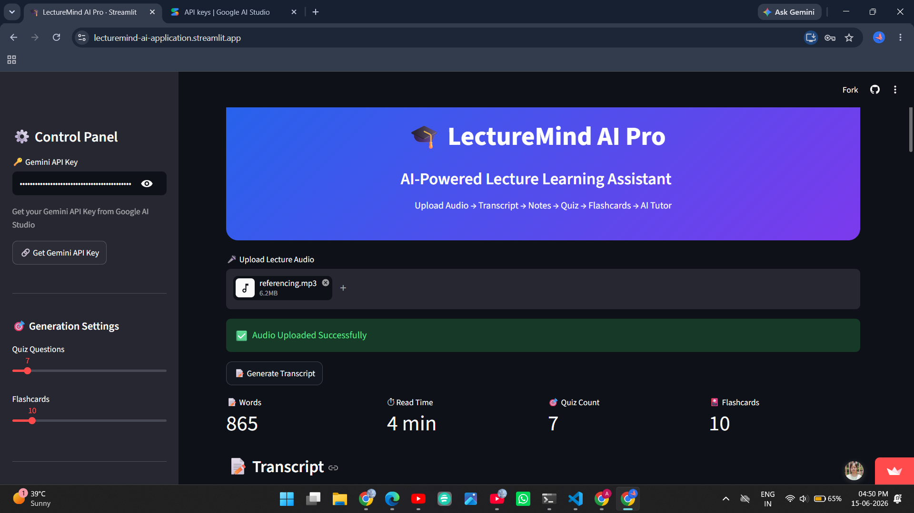
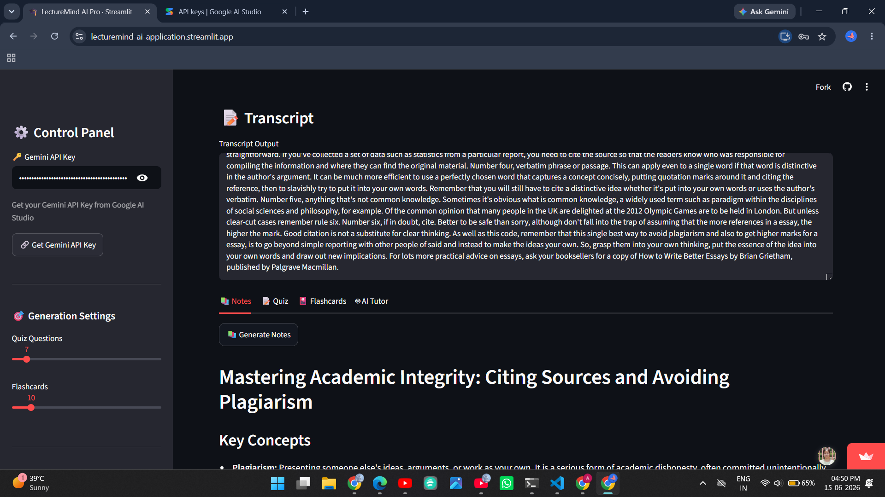
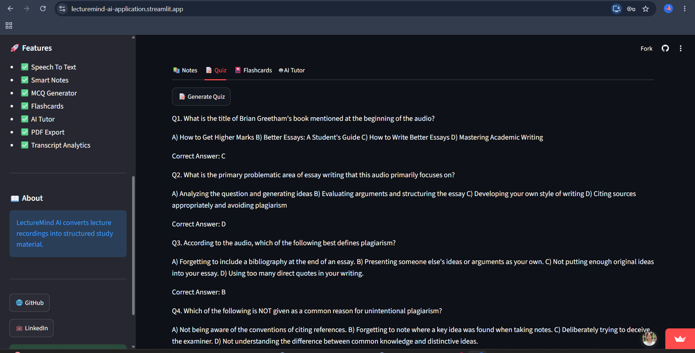
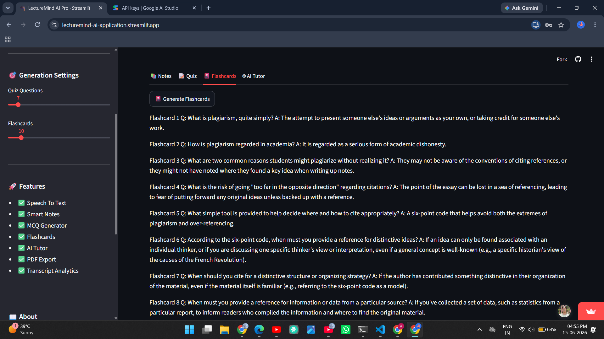
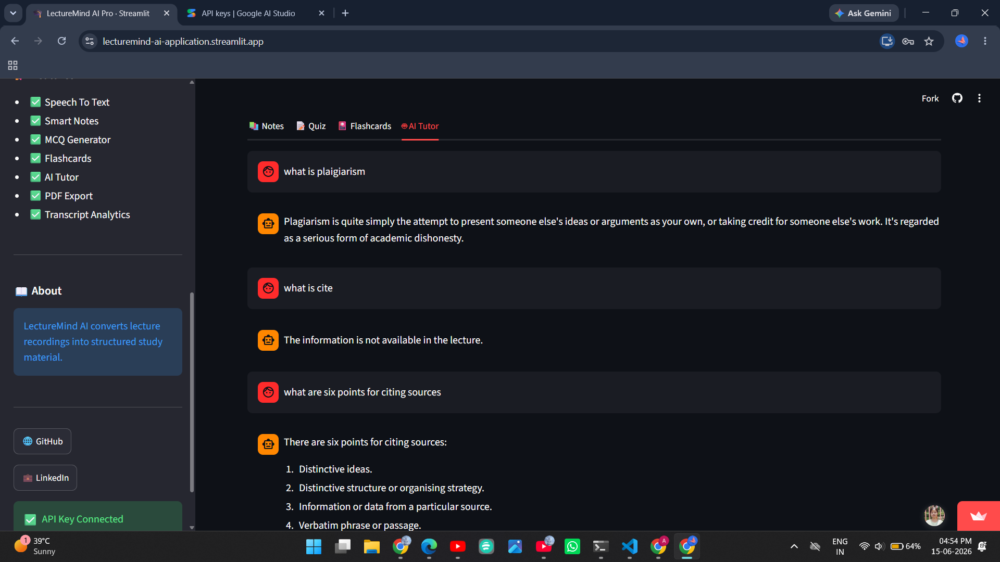

# 🎓 LectureMind AI Pro

An AI-powered lecture learning assistant that transforms audio recordings into structured study resources including notes, quizzes, flashcards, and interactive Q&A.

---

## 🚀 Live Demo

🔗 https://lecturemind-ai-application.streamlit.app

---

## 💡 Why I Built This

Students often spend more time organizing lecture content than actually learning from it. I built LectureMind AI to automate that process by converting lecture recordings into structured learning materials that help with faster revision, active recall, and better exam preparation.

---

## ✨ Features

### 🎤 Speech-to-Text Transcription

Convert lecture audio into accurate text transcripts using OpenAI Whisper.

### 📝 Smart Notes Generation

Generate structured study notes containing:

* Key Concepts
* Important Points
* Summary
* Exam Notes

### ❓ MCQ Quiz Generator

Automatically create multiple-choice questions from lecture content.

### 🎴 Flashcard Generator

Generate flashcards for active recall learning and quick revision.

### 🤖 AI Tutor

Ask questions related to the lecture transcript and receive contextual answers.

### 📄 PDF Export

Download generated notes for offline access and revision.

### 📊 Transcript Analytics

View:

* Word Count
* Estimated Reading Time
* Lecture Statistics

---

## 🖼️ Application Screenshots

### 🏠 Dashboard



### 📝 Smart Notes



### ❓ Quiz Generator



### 🎴 Flashcards



### 🤖 AI Tutor



---

## ⚙️ How It Works

```text
Upload Audio
      ↓
Generate Transcript
      ↓
Create Notes
      ↓
Generate Quiz
      ↓
Generate Flashcards
      ↓
Ask Questions with AI Tutor
```

---

## 🛠️ Tech Stack

### Frontend

* Streamlit

### AI Models

* Google Gemini
* OpenAI Whisper

### Backend

* Python

### Libraries

* streamlit
* google-generativeai
* openai-whisper
* reportlab
* python-dotenv

---

## 📂 Project Structure

```text
LectureMind-AI/
│
├── app.py
├── requirements.txt
├── packages.txt
├── README.md
│
├── assets/
│   ├── dashboard.png
│   ├── notes.png
│   ├── quiz.png
│   ├── flashcards.png
│   └── tutor.png
│
└── utils/
    ├── transcribe.py
    └── gemini_utils.py
```

---

## 🔑 Gemini API Setup

1. Open Google AI Studio
2. Generate a Gemini API Key
3. Paste the key into the application sidebar
4. Start generating notes, quizzes, and flashcards

Google AI Studio:

https://aistudio.google.com/app/apikey

---

## 💻 Installation

Clone the repository:

```bash
git clone https://github.com/your-username/LectureMind-AI.git
cd LectureMind-AI
```

Create virtual environment:

```bash
python -m venv venv
```

Activate environment:

### Windows

```bash
venv\Scripts\activate
```

### Linux / Mac

```bash
source venv/bin/activate
```

Install dependencies:

```bash
pip install -r requirements.txt
```

Run the application:

```bash
streamlit run app.py
```

---

## 🎯 Future Improvements

* Multi-language support
* YouTube lecture summarization
* Study plan generation
* Lecture search functionality
* Vector database integration
* Personalized learning recommendations

---

## 👩‍💻 Author

**Shivali Gupta**

M.Sc. Data Science
Indian Institute of Information Technology (IIIT) Lucknow

---

## ⭐ Support

If you found this project useful, consider giving it a star on GitHub.

---

## 📜 License

This project is developed for educational and portfolio purposes.

### 🌟 Transform Lectures into Smart Learning Resources with LectureMind AI! 🚀
